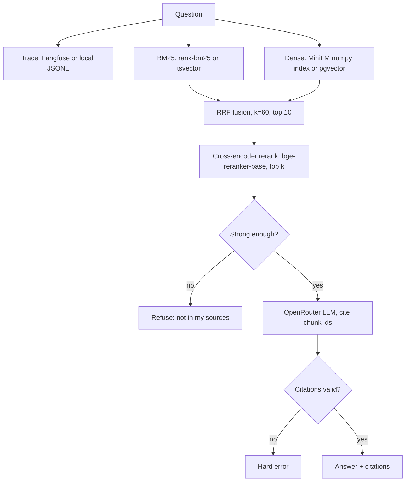

# chef-rag

 <!-- eval-badge:start -->

<!-- eval-badge:end -->  

A cited, refuse-when-unsure RAG system for professional kitchen knowledge: techniques, food safety, kitchen management, ratios and temperatures. Hybrid retrieval, cross-encoder rerank, citation-constrained generation, every request traced.

## Why this domain

Most RAG demos use Wikipedia or PDF chatbots. This one is built on 10 years of professional kitchen knowledge that no CS applicant can replicate -- from line cook to Head Chef. The domain is the differentiator; the engineering is the argument.

## Demo

Live demo: _placeholder, deploy with [docs/deploy-hf.md](docs/deploy-hf.md)_ (Hugging Face Space, local backend, rate limited, daily token cap).

## Results

Ablation on the golden set (`evals/golden.jsonl`, 68 questions): BM25 only, dense only, hybrid (RRF k=60), hybrid plus bge-reranker-base. Reproduce with `uv run python evals/run_evals.py` (add `--live` for the Ragas columns).

<!-- ablation:start -->
_Not yet run. The first real run needs the downloaded corpus, model weights and an OpenRouter key: see [docs/eval-runbook.md](docs/eval-runbook.md)._
<!-- ablation:end -->

Why the ablation is a four-way table: the design rule is "never dense-only", and this is the evidence for or against it. Golden questions include out-of-corpus ones that must be refused, and `outdated` ones where a 1907 text conflicts with the FDA Food Code and the right answer prefers the FDA.

## Architecture



## Corpus

Public domain only: Escoffier, Farmer and Beeton from Project Gutenberg, the FDA Food Code, and USDA FSIS guidance. Sources, license basis and retrieval dates are in [data/SOURCES.md](data/SOURCES.md). Your own notes go in `data/raw/original/` (format in its README) and are the only documents typed `original`.

## What I'd do next

1. Run the live baseline on the real corpus, then calibrate the refusal threshold from the gate sweep.
2. Add the author's original notes and re-run to measure how much domain content moves faithfulness.
3. Add a reduced-oxygen and sous vide source so modern technique questions stop being out of corpus.

## Setup

```bash
uv sync --all-extras
# 1. get the corpus (needs network): docs/corpus-runbook.md
uv run python scripts/fetch_corpus.py
# 2. chunk and index (local MiniLM embeddings)
uv run python -m src.cli ingest --source data/raw/ --out data/processed/ --index
# 3. query
uv run python -m src.cli query "What temperature must poultry reach?" --backend local --show-scores
uv run python -m src.cli query "..." --answer       # cited answer; needs OPENROUTER_API_KEY
# 4. evals
uv run python evals/run_evals.py
# 5. demo locally
uv run uvicorn --factory src.demo:build_app --port 7860
# checks
uv run ruff check . && uv run ruff format --check . && uv run mypy src/ && uv run pytest -q
```

Environment variables are read from the shell or `.env` (never committed): `OPENROUTER_API_KEY` (generation and live evals), `LANGFUSE_PUBLIC_KEY`, `LANGFUSE_SECRET_KEY`, `LANGFUSE_HOST` (traces; without them traces go to `.traces/`), `SUPABASE_URL`, `SUPABASE_KEY` (only for `--backend supabase`; schema in `supabase/migrations/`). Local retrieval, ingest and tests need no keys. See [docs/design.md](docs/design.md) for schemas and contracts and [ROADMAP.md](ROADMAP.md) for status.

---

_Solomon Smith, built May 2026_
